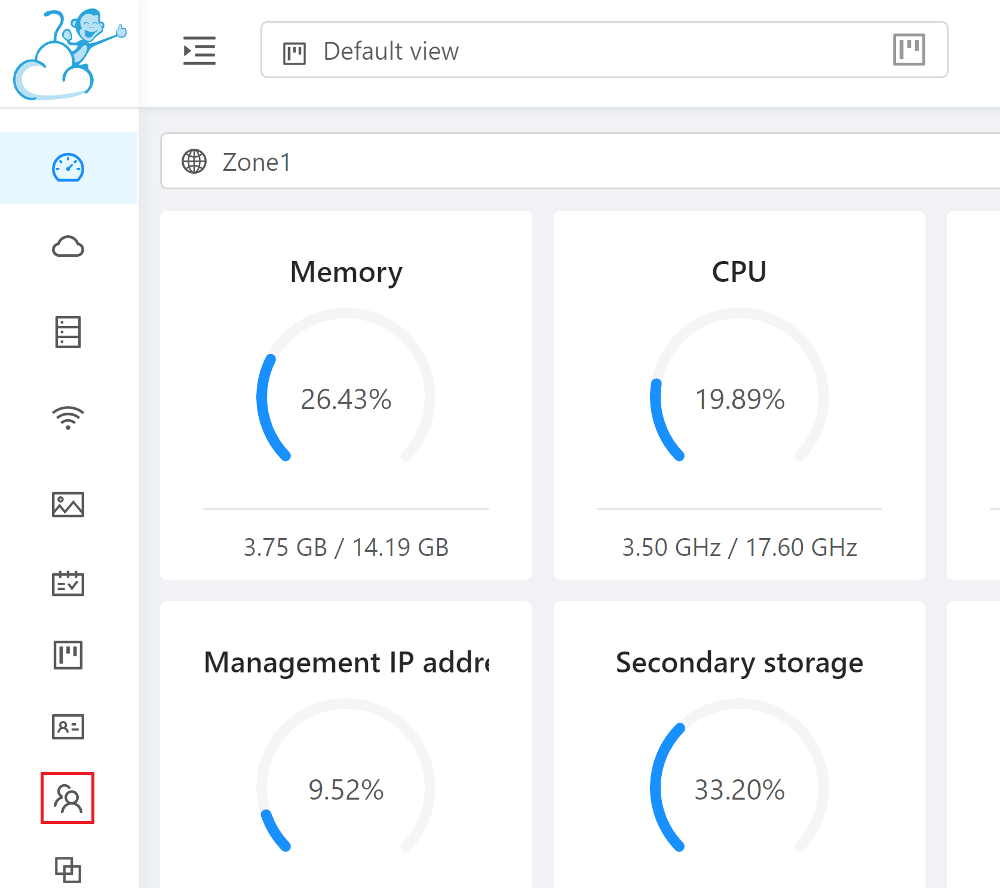

# Create CloudStack instance using Terraform

Create instances of CloudStack more easily with Terraform.

## Prerequisites

- Download Terraform 1.24 version and set global variables
- You should prepare your cloudstack's api-key and secret-key.

## How to get api-key
1. Log in to your cloud stack.
 

2. Click on the account menu in the left menu.


3. Select an account to use the api key.


4. Click view user at the bottom of the selected account.


5. Select an user to use the api key


6. get api-key and secret-key


## Deploy Using the Terraform CLI

### Clone the Module
Create a local copy of this repository:

    git clone https://github.com/ZConverter/cloudstack-terraform.git
    cd cloudstack-terraform
    ls

### Set Up and Configure Terraform

1. Create a `terraform.json` file, and specify the following variables:

```
# Authentication
{
	"generate": {
		"cloud_platform": "cloudstack",
		"auth": {
			"api_url" : null,
			"api_key" : null,
			"secret_key" : null
		},
		"vm_info": {
			"vm_name" : null,
			"service_offering" : null,
			"template" : null,
			"zone" : null,
			"project" : null,
			"affinity_group_names" : null,
			"root_disk_size" : null,
			"network_id" : null,
			"security_group_names" : null,
			"ip_address" : null,
			"volume" : [],
			"user_data_file_path" : null,
			"create_security_group" : {
				"ingress" : [{
					"cidr" : null,
					"protocol" : null,
					"port" : null
				}],
				"egress" : [{
					"cidr" : null,
					"protocol" : null,
					"port" : null
				}]
			}
		}
	}
}

#Requirement
generate.auth.api_url : user cloudstack's api_url.ex : http://xxx.xxx.xxx.xxx:8080/client/api
generate.auth.api_key : your cloudstack api_key
generate.auth.secret_key : your cloud stack secret_key
generate.vm_info.vm_name : Name of the instance you want to create, type "zdm" if you want to create zdm
generate.vm_info.service_offering : service_offering of the instance to be created
generate.vm_info.template : OS of instance - User registration template, if you want to use zconverter's product, linux series must be a template with cloud-init and Windows series must be a template with cloud-init functioning
generate.vm_info.zone : The zone where the instance will be created

#Optional
generate.vm_info.project : Project name to register the instance or null
generate.vm_info.affinity_group_names : String array or null name of affinity_group you will use. ex : ["xxxxxx", "xxxxxx"]
generate.vm_info.root_disk_size : Boot disk capacity for an instance.
generate.vm_info.network_id : id.default of the network to which the instance will connect. null input when using the network
generate.vm_info.security_group_names : The name of the security_groups of string array type used for the instance ex: ["xxxxxx", "xxxxxx"]
generate.vm_info.ip_address : The id value of the ip_address to be assigned, if zdm is generated, must be entered.
generate.vm_info.volume : Assign an additional disk, if you create a zdm or zdm target, at least one additional disk is required.
generate.vm_info.user_data_file_path: User data file location, if zdm, user data is automatically generated and no input is required. zdm source, zdm target generates scripts in the scripts folder after zdm creates them, so you can use the script generated during zdm source, zdm target creation.
generate.vm_info.create_security_group : Adding a security group rule, creating the required ingress and egress creates the rule
````

### Create the Resources
Run the following commands:

    terraform init
    terraform plan -var-file=terraform.json
    terraform apply -var-file=terraform.json -auto-approve

### Destroy the Deployment
When you no longer need the deployment, you can run this command to destroy the resources:

    terraform destroy -var-file=terraform.json -auto-approve
